# SCM (Sooncheonhyang Cafeteria Manager)

SCM은 순천향대학교 학생과 교직원들에게 최신 학식 정보를 직관적으로 제공하고, 식당 관리자에게는 손쉬운 정보 관리 기능을 제공하는 '학식 정보 플랫폼'입니다.

교내 식당 메뉴를 확인하기 위해 식당에 직접 방문해야만 했던 불편함을 해소하고, 언제 어디서든 정확한 최신 식단 정보를 확인할 수 있는 편리한 환경을 제공하기 위해 개발하였습니다.

## 📥 다운로드 링크

---

## 🧑‍💻 팀원
| 이름  | 역할             |
|-----|----------------|
| 김경탁 | PM, Backend 팀장 |
| 서재흔 | Frontend 팀장    |
| 성현석 | Backend        |

## 🔗 Related Links

| 구분           | 기술 스택        | 저장소 링크                                                        |
|--------------| ---------------- |---------------------------------------------------------------|
| **Backend**  | Spring Boot      | [BE Repository Link](https://github.com/kkt9253/SCH_Manager)   |
| **Frontend** | Android (Kotlin/Java) | [FE Repository Link](https://github.com/SeoJH27/SCM) |

---

## ✨ 주요 기능

SCM은 사용자 역할에 따라 맞춤형 기능을 제공하여 효율적인 식단 관리 및 조회가 가능하도록 설계되었습니다.

### 👩‍🎓 **일반 사용자 (학생 및 교직원)**
- **오늘의 학식 통합 조회**: 모든 식당의 당일 메뉴를 한눈에 확인할 수 있습니다.
- **주간 학식 상세 조회**: 특정 식당을 선택하여 일주일치 식단과 운영 시간, 조기 마감 여부 등 상세 정보를 조회할 수 있습니다.
- **로그인 없는 빠른 접근**: 별도의 로그인 절차 없이 앱의 모든 기능을 즉시 이용할 수 있습니다.

### 👨‍💼 **식당 관리자 (Admin)**
- **식단 정보 업로드**: 주간 또는 당일 식단표를 이미지나 텍스트로 손쉽게 업로드할 수 있습니다.
- **운영 정보 관리**: 식당의 고정 운영 시간을 수정하거나, 조기 마감 여부를 실시간으로 설정할 수 있습니다.
- **업로드 후 검수 요청**: 업로드된 식단은 최종 승인권자인 'Master'에게 전달되어 검수 과정을 거칩니다.

### 💻 **최종 승인권자 (Master)**
- **식단 검수 및 최종 승인**: 관리자가 업로드한 식단 정보를 검토하고, 최종적으로 승인하여 사용자에게 노출시킵니다.
- **안정적인 정보 제공**: 검수 과정을 통해 사용자에게 정확하고 신뢰도 높은 학식 정보를 제공하는 역할을 합니다.

---

## ⚙️ 서비스 워크플로우

SCM은 **`Admin` → `Master` → `User`** 로 이어지는 체계적인 데이터 처리 흐름을 통해 정확하고 검증된 학식 정보를 사용자에게 제공합니다.

1.  **Admin (식당 관리자)**: 식단 정보를 시스템에 업로드합니다. 이때 메뉴 상태는 **`PENDING`(승인 대기)** 으로 설정되어 데이터베이스에 저장됩니다.
2.  **Master (최종 승인권자)**: `PENDING` 상태의 식단 정보를 자신의 관리자 페이지에서 확인하고, 내용 검토 후 최종 승인 처리를 합니다.
3.  **User (일반 사용자)**: Master가 승인한 **`APPROVED`(승인 완료)** 상태의 식단 정보만을 앱 메인 화면에서 조회하게 됩니다.

이러한 3단계 워크플로우는 정보의 정확성을 보장하며, 관리자 실수로 인한 잘못된 정보 노출을 방지합니다.

---

## 🛠️ 기술 스택 및 서비스 아키텍처

### 🖥️ Server / DB
- Java 17
- Spring Boot
- Spring Data JPA
- Spring Security
- JWT
- QueryDSL
- MariaDB
- Redis

### 🏗️ Infra
- Raspberry Pi 5 기반 On-Premise Server

---

# 📱 서비스 화면

# 학생 및 교직원 (일반 USer)

## 메인
직관적인 UI를 통해 간편하게 "오늘의 학식 조회" & "특정 식당의 일주일 학식 조회"를 제공합니다.

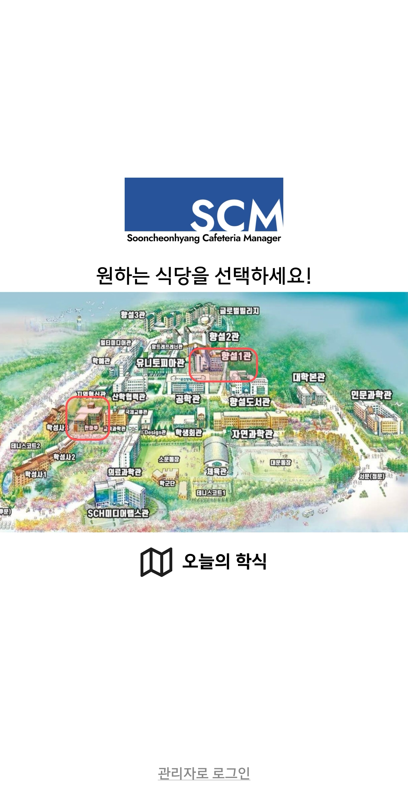

---
## 오늘의 학식
금일에 해당하는 모든 식당의 학식 정보를 통합 조회할 수 있습니다.

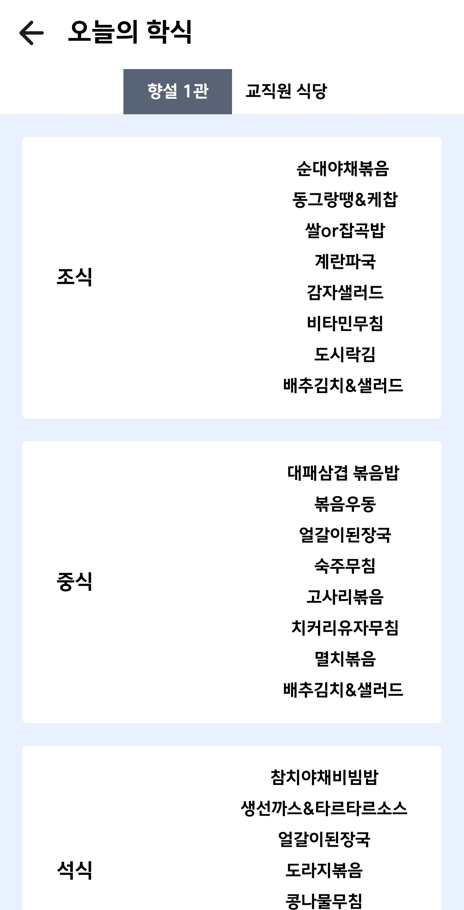

---
## 식당 별 일주일 학식 조회
특정 식당에 대한 다양한 정보 조회할 수 있다.

- 구성요소:
  - 운영시간
  - 조기 마감 여부
  - 식당 위치
  - 학식 가격
  - 일주일에 해당하는 학식 정보

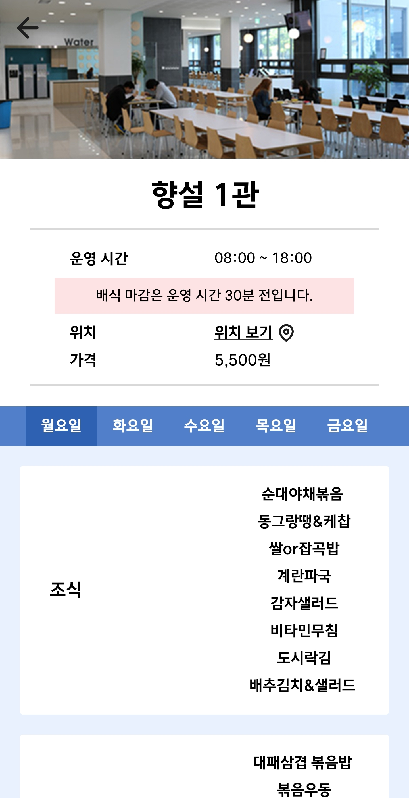
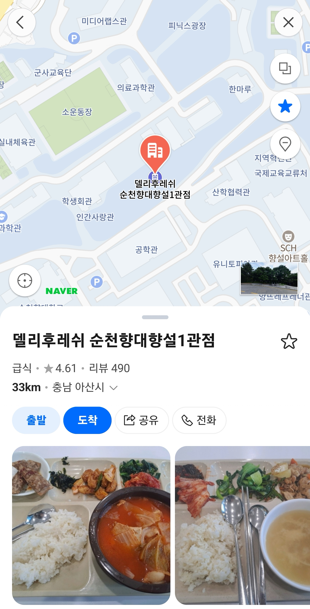

---
## 앱 문의
'앱 문의 하기' 클릭 시 카카오톡 오픈채팅을 통해 문의할 수 있습니다.

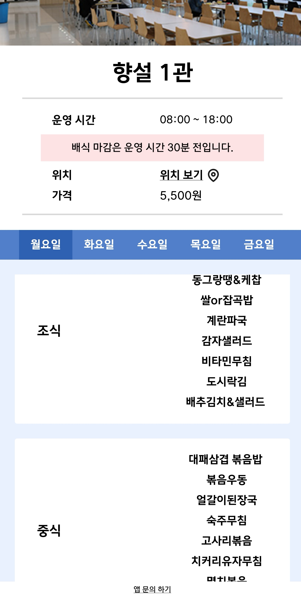
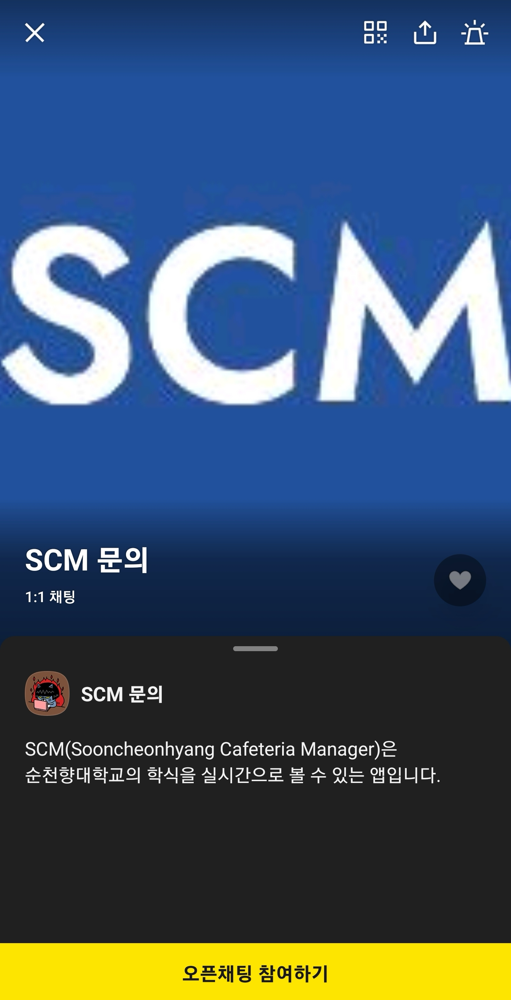

---
# 식당 관리자 (Admin)

## 관리자 메인화면
다양한 식당의 정보를 간단히 업로드하고 관리할 수 있습니다.
- 구성요소:
  - 식당 조기마감 여부 업로드
  - 학식 메뉴 업로드 (이미지 or 텍스트)
  - 식당 오픈시간 수정

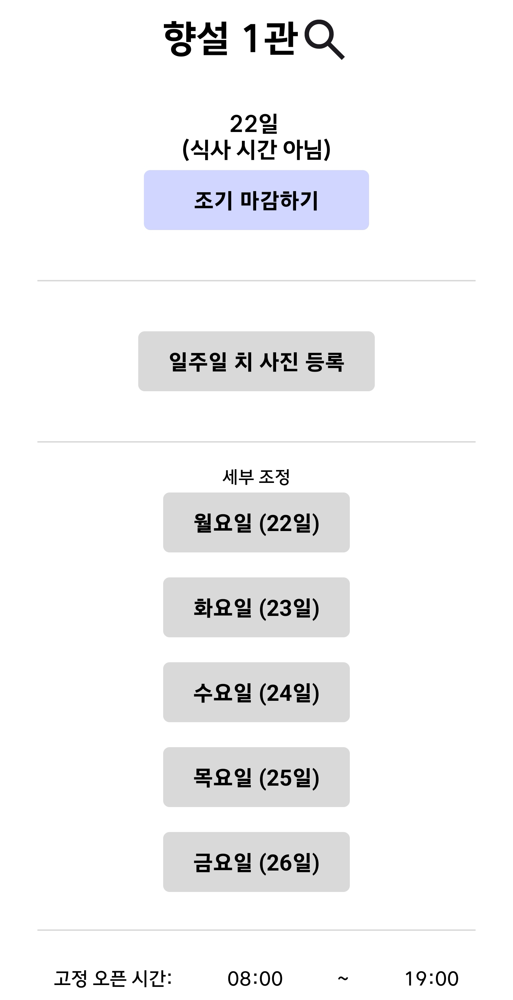

---
## 주간 학식 정보 업로드
일주일치 식단표 사진을 업로드하여 각 요일별 메뉴 등록에 활용합니다.

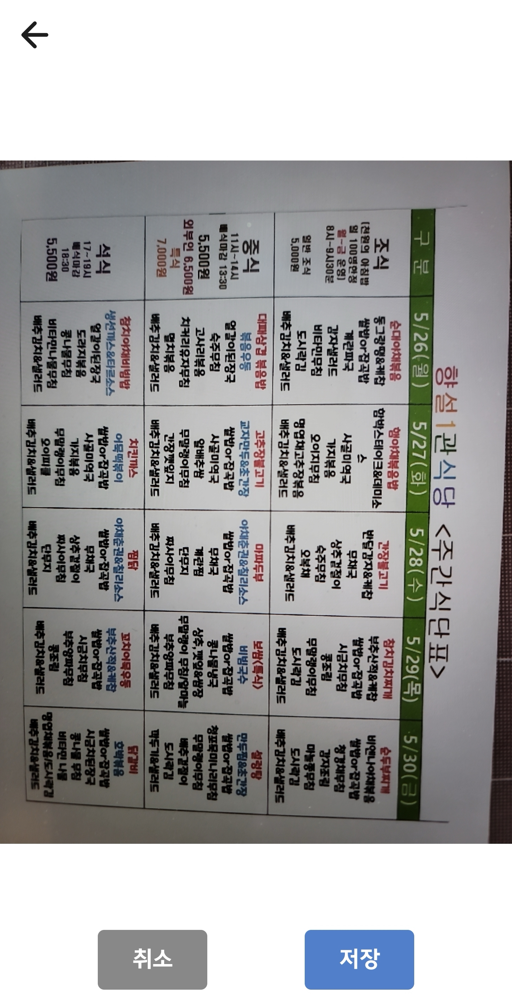

---
## 요일별 학식 정보 업로드
OCR 또는 텍스트 입력을 통해 요일별 조/중/석식 정보를 기입하고 Master에게 승인을 요청합니다.
- 구성요소:
  - OCR 또는 직접 텍스트 입력(선택)을 통한 n요일의 식단표 업로드
  - 조/중/석식의 운영 시간 변경

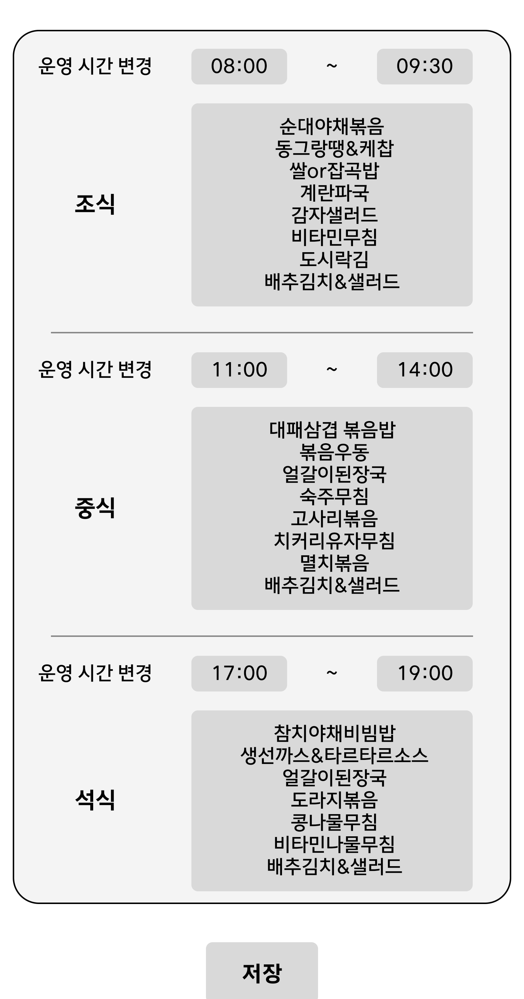

---

# 앱 개발자 & 최종 승인자 (Master)

## 메인화면
관리자(Admin)가 업로드한 정보를 최종 검수하고, 승인 시 즉시 사용자에게 정보를 제공합니다.

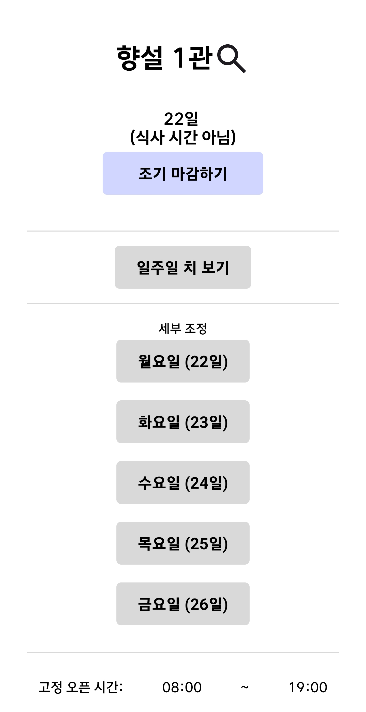

---
## Admin 업로드 정보 확인
관리자가 업로드한 주간 학식표 이미지를 확인합니다.

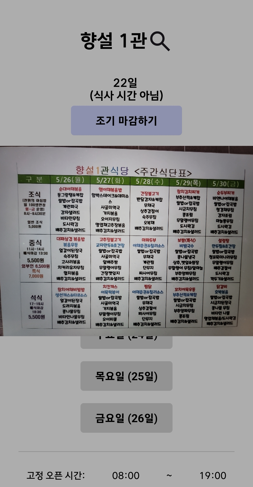

---
## 학식 업로드 최종 확인 및 승인
관리자가 등록한 요일별 학식 정보를 최종 검토 후 승인하여 사용자 화면에 게시합니다.

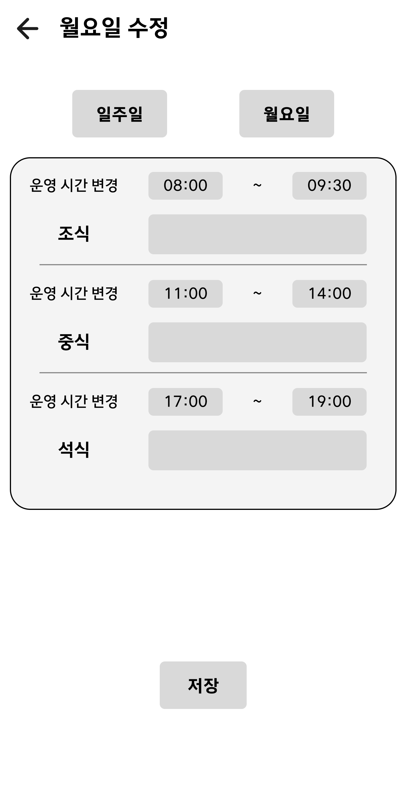
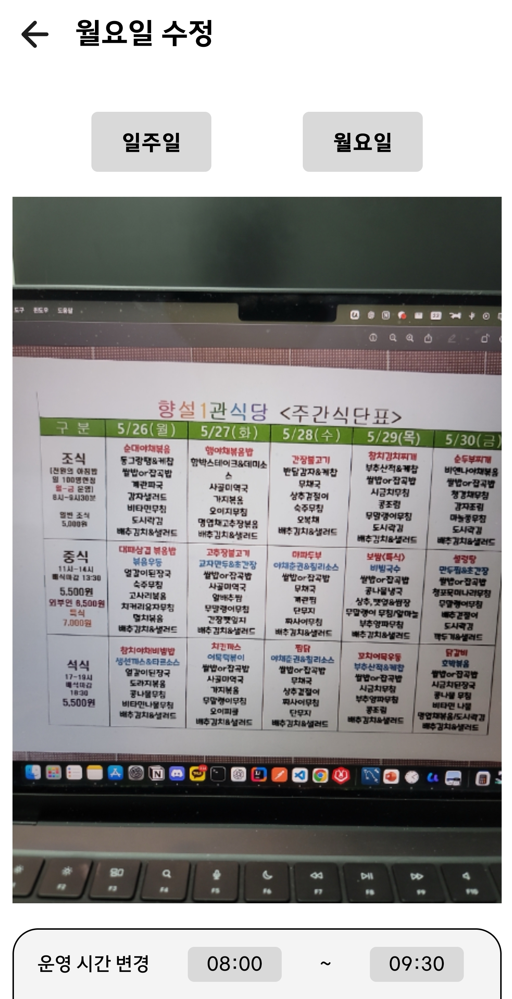
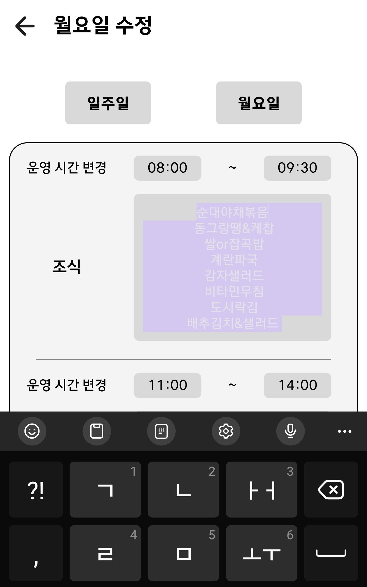

---

# 부가기능

## 로그인 및 로그아웃

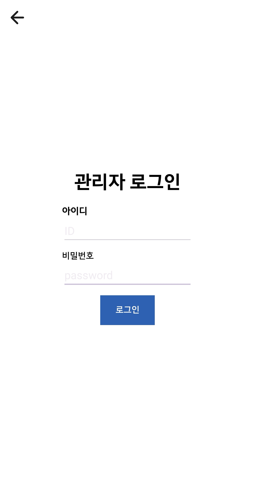

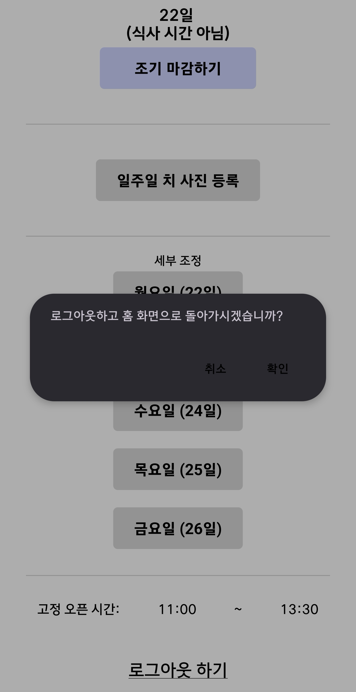